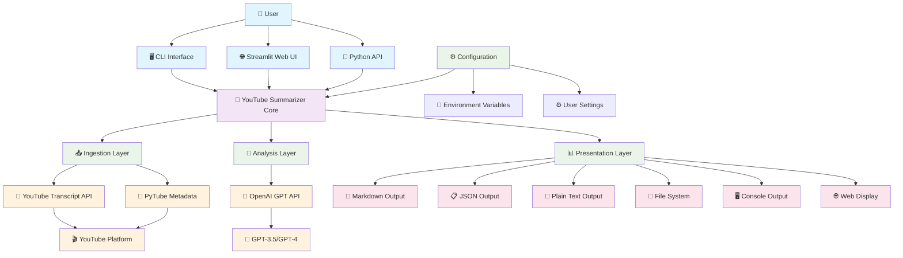
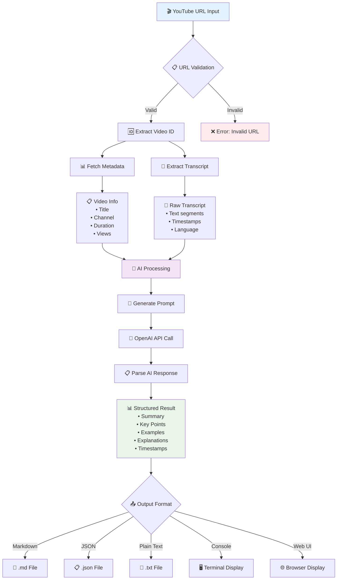
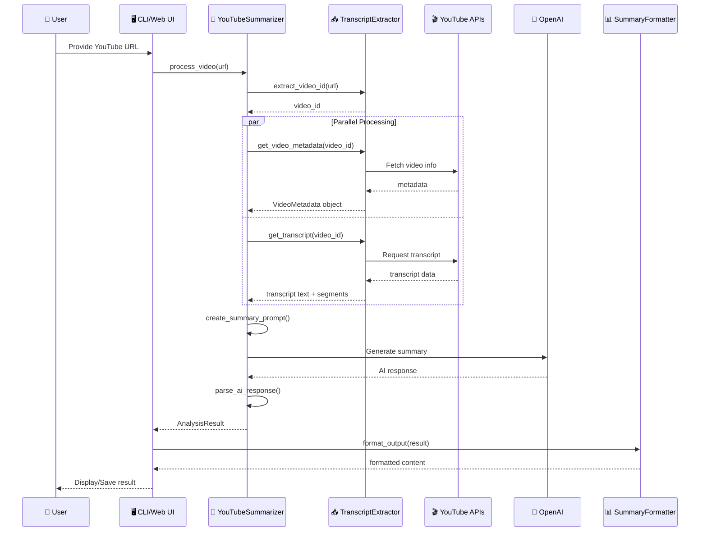

## 1. System Architecture Diagram



## 2. Data Flow Architecture



## 3. Component Interaction Diagram



## 4. Core Concepts & Workflow

### **A. Core Components**

#### **1. Ingestion Layer (`ingestion.py`)**
**Purpose**: Extract raw data from YouTube
- **TranscriptExtractor**: Main orchestrator
- **Video ID Extraction**: Handles multiple URL formats
- **Metadata Retrieval**: Uses PyTube for video information
- **Transcript Extraction**: Uses YouTube Transcript API with fallbacks

**Key Functions**:
```python
extract_video_id(url) → video_id
get_video_metadata(video_id) → VideoMetadata
get_transcript(video_id) → (text, segments)
process_video(url) → (metadata, transcript, segments)
```

#### **2. Analysis Layer (`analysis.py`)**
**Purpose**: AI-powered content analysis and summarization
- **YouTubeSummarizer**: Main analysis engine
- **Prompt Engineering**: Creates optimized prompts for different styles
- **AI Integration**: Handles OpenAI API communication
- **Response Parsing**: Extracts structured data from AI responses

**Key Functions**:
```python
create_summary_prompt() → optimized_prompt
summarize_video() → AnalysisResult  
parse_ai_response() → structured_data
```

#### **3. Presentation Layer (`presentation.py`)**
**Purpose**: Format and output results
- **SummaryFormatter**: Handles multiple output formats
- **Format Conversion**: Markdown, JSON, Plain Text
- **File Operations**: Save to various file types

**Key Functions**:
```python
to_markdown(result) → markdown_string
to_json(result) → json_dict
save_to_file(result, path, format) → file
```

### **B. Data Models**

#### **Core Data Structures**:
```python
@dataclass
class VideoMetadata:
    title: str
    channel: str  
    duration: int
    description: str
    view_count: int
    publish_date: str
    video_id: str

@dataclass  
class AnalysisResult:
    summary: str
    key_points: List[str]
    examples: List[str] 
    explanations: List[str]
    timestamps: List[Dict]
    metadata: VideoMetadata
    transcript: str
```

### **C. Processing Workflow**

#### **Phase 1: Data Extraction**
1. **URL Processing**: Extract video ID from various YouTube URL formats
2. **Parallel Fetching**: 
   - Metadata via PyTube (title, channel, duration, views)
   - Transcript via YouTube Transcript API (text, timestamps)
3. **Language Handling**: Prioritizes English, falls back to available languages
4. **Error Handling**: Graceful fallbacks for missing data

#### **Phase 2: AI Analysis**
1. **Prompt Construction**: 
   - Combines transcript + metadata
   - Applies style and length preferences
   - Includes specific instructions for examples/explanations
2. **AI Processing**:
   - Sends structured prompt to OpenAI
   - Uses appropriate model (GPT-3.5 or GPT-4)
   - Applies temperature settings for consistency
3. **Response Parsing**:
   - Extracts sections using regex patterns
   - Converts bullet points to structured lists
   - Parses timestamps and descriptions

#### **Phase 3: Output Generation**
1. **Format Selection**: User chooses output format
2. **Content Formatting**: Applies appropriate styling
3. **Delivery**: Console display, file save, or web interface

### **D. Key Design Patterns**

#### **1. Pipeline Pattern**
```
URL → Extract → Process → Analyze → Format → Output
```

#### **2. Strategy Pattern** 
Different summary styles and lengths implemented as enums:
```python
SummaryStyle: CONCISE, DETAILED, BULLET_POINTS, ACADEMIC
SummaryLength: SHORT, MEDIUM, LONG
```

#### **3. Factory Pattern**
SummaryFormatter creates different output formats based on type

#### **4. Error Handling Strategy**
- **Graceful Degradation**: Missing metadata doesn't stop processing
- **Retry Logic**: Multiple language attempts for transcripts
- **Validation**: URL format checking before processing
- **User Feedback**: Clear error messages with suggestions

### **E. Configuration & Extensibility**

#### **Environment-Based Configuration**:
```bash
OPENAI_API_KEY=your_key
OPENAI_MODEL=gpt-3.5-turbo
DEFAULT_SUMMARY_LENGTH=medium
DEFAULT_STYLE=detailed
```

#### **Extensibility Points**:
1. **New Output Formats**: Add methods to SummaryFormatter
2. **Additional AI Models**: Extend model options in analysis.py
3. **New Summary Styles**: Add to SummaryStyle enum
4. **Custom Prompts**: Override prompt creation methods
5. **Additional Platforms**: Extend ingestion layer for other video sites

### **F. Performance Considerations**

#### **Optimization Strategies**:
1. **Parallel Processing**: Metadata and transcript fetched simultaneously
2. **Caching**: Results can be cached to avoid re-processing
3. **Streaming**: Large transcripts processed in chunks
4. **Rate Limiting**: Built-in respect for API limits
5. **Model Selection**: Choose appropriate AI model for use case

#### **Scalability Features**:
- **Async Support**: Ready for async/await implementation
- **Batch Processing**: Can process multiple videos
- **Docker Support**: Easy deployment and scaling
- **API Integration**: Clean Python API for automation

This architecture provides a robust, scalable, and maintainable solution for YouTube video summarization with clear separation of concerns and extensible design patterns.