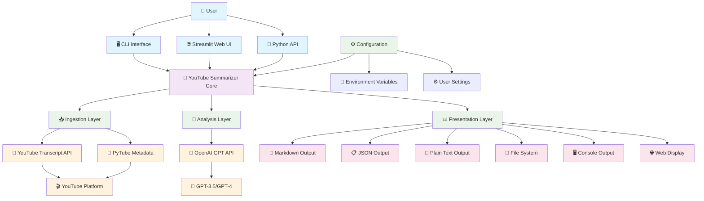

# YouTube Summarizer - Usage Guide

## Installation

### Using Poetry (Recommended)
```bash
git clone https://github.com/yourusername/youtube-summarizer.git
cd youtube-summarizer
poetry install



```mermaid
graph TB
    %% User Interfaces
    User[👤 User] --> CLI[🖥️ CLI Interface]
    User --> WebUI[🌐 Streamlit Web UI]
    User --> API[🔧 Python API]
    
    %% Core Processing Layer
    CLI --> Core[🧠 YouTube Summarizer Core]
    WebUI --> Core
    API --> Core
    
    %% Processing Components
    Core --> Ingestion[📥 Ingestion Layer]
    Ingestion --> TranscriptAPI[📝 YouTube Transcript API]
    Ingestion --> PyTube[🎥 PyTube Metadata]
    
    Core --> Analysis[🤖 Analysis Layer]
    Analysis --> OpenAI[🔮 OpenAI GPT API]
    
    Core --> Presentation[📊 Presentation Layer]
    Presentation --> Markdown[📄 Markdown Output]
    Presentation --> JSON[📋 JSON Output]
    Presentation --> PlainText[📝 Plain Text Output]
    
    %% External Dependencies
    TranscriptAPI --> YouTube[🎬 YouTube Platform]
    PyTube --> YouTube
    OpenAI --> GPTModels[🧠 GPT-3.5/GPT-4]
    
    %% Output Destinations
    Presentation --> FileSystem[💾 File System]
    Presentation --> Console[🖥️ Console Output]
    Presentation --> WebDisplay[🌐 Web Display]
    
    %% Configuration
    Config[⚙️ Configuration] --> Core
    Config --> EnvVars[🔐 Environment Variables]
    Config --> Settings[⚙️ User Settings]
    
    classDef interface fill:#e1f5fe
    classDef core fill:#f3e5f5
    classDef processing fill:#e8f5e8
    classDef external fill:#fff3e0
    classDef output fill:#fce4ec
    
    class User,CLI,WebUI,API interface
    class Core core
    class Ingestion,Analysis,Presentation,Config processing
    class TranscriptAPI,PyTube,OpenAI,YouTube,GPTModels external
    class Markdown,JSON,PlainText,FileSystem,Console,WebDisplay output
```